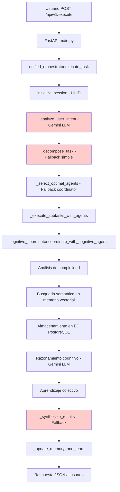

# AgentOS MVP - ANÁLISIS COMPLETO DEL FLUJO ACTUAL Y PROPUESTA ENTERPRISE
## Documentación Técnica Detallada - Análisis de Flujo y Mejoras

**Fecha:** 28 de Julio 2025  
**Versión:** System Flow Analysis 8.0  
**Estado:** 🔍 Análisis Exhaustivo del Flujo Actual + Propuesta Enterprise  
**Contexto:** Evolución desde docs6.md (unificación) + docs7.md (operación) + enterprise_analysis.md

---

## 📊 ANÁLISIS EXHAUSTIVO DEL FLUJO ACTUAL

### **🔍 1. DÓNDE SE ALMACENA LA INFORMACIÓN**

#### **A. ALMACENAMIENTO ESTRUCTURADO (PostgreSQL)**

```sql
-- CONVERSACIONES Y MENSAJES
conversations: {
    id: session_id (String PK),
    agent_id: String,
    created_at/updated_at: DateTime,
    is_active: Boolean,
    extra_data: JSON
}

messages: {
    id: Integer PK,
    conversation_id: String FK,
    role: 'user'/'assistant',
    content: Text,
    agent_id: String,
    tools_used: JSON[],
    timestamp: DateTime
}

-- MEMORIA DE AGENTES
agent_memory: {
    id: Integer PK,
    agent_id: String,
    memory_type: 'short_term'/'medium_term'/'long_term',
    content: Text,
    importance_score: 1-10,
    source_conversation_id: String,
    expires_at: DateTime
}

-- CONOCIMIENTO ACUMULADO
agent_knowledge: {
    id: Integer PK,
    agent_id: String,
    knowledge_type: 'pattern'/'fact'/'procedure'/'preference',
    confidence_score: 1-10,
    usage_count: Integer,
    success_rate: Percentage
}
```

#### **B. ALMACENAMIENTO VECTORIAL (En Memoria + BD)**

```python
# backend/app/memory/vector_memory.py
class VectorMemorySystem:
    def __init__(self):
        self.vector_stores = {}  # En memoria durante ejecución
        self.embeddings_cache = {}
        # Respaldo en PostgreSQL via agent_memory
    
    async def store_memory(self, agent_id, memory_type, content):
        # Genera embeddings
        # Almacena en vector store en memoria
        # Guarda en BD para persistencia
```

#### **C. ESTADO DE EJECUCIÓN (En Memoria - PROBLEMA)**

```python
# backend/app/orchestrator.py - PROBLEMA IDENTIFICADO
class UnifiedOrchestrator:
    def __init__(self):
        self.session_id = None          # ❌ Se pierde al reiniciar
        self.current_task = None        # ❌ Se pierde al reiniciar
        self.memory_context = {}        # ❌ Se pierde al reiniciar
        # ESTE ES EL PROBLEMA ENTERPRISE PRINCIPAL
```

### **🔄 2. ETAPAS DEL FLUJO ACTUAL**

#### **ETAPA 1: RECEPCIÓN Y VALIDACIÓN**
```python
# main.py:144 - /api/v1/execute
@app.post("/api/v1/execute")
async def execute_unified_task(request: UnifiedTaskRequest):
    # INPUT: {query, context, priority, optimization_level}
    # VALIDACIÓN: Pydantic models
    # LOG: "🚀 Ejecutando tarea unificada: query..."
```

#### **ETAPA 2: INICIALIZACIÓN DEL ORQUESTADOR**
```python
# orchestrator.py:140 - execute_task()
async def execute_task(self, user_query: str):
    # 1. session_id = await self.initialize_session(user_query)
    # 2. memory_context = await self._retrieve_memory_context(user_query)
    # 3. results = await self._execute_subtasks_with_agents()
    # 4. final_result = await self._synthesize_results(results)
    # 5. await self._update_memory_and_learn(user_query, final_result)
```

#### **ETAPA 3: ANÁLISIS DE INTENCIÓN**
```python
# orchestrator.py:70 - _analyze_user_intent()
async def _analyze_user_intent(self, query: str):
    prompt = f"""
    Analiza la siguiente consulta del usuario y determina:
    1. Tipo de tarea (investigación, análisis, creación, optimización, etc.)
    2. Complejidad (baja, media, alta)
    3. Herramientas necesarias (web_search, document_analysis, data_visualization, etc.)
    4. Agentes cognitivos requeridos
    5. Patrón de coordinación recomendado (AutoGen, MIRIX, G-Memory, etc.)
    """
    # PROBLEMA: Prompt hardcodeado, no optimizado
    # RESULTADO ACTUAL: {"intent": "general", "confidence": 0.5} (fallback)
```

#### **ETAPA 4: DESCOMPOSICIÓN DE TAREAS**
```python
# orchestrator.py:90 - _decompose_task()
async def _decompose_task(self, query: str, intent: Dict):
    # PROBLEMA: Chain-of-Thought básico, no estructurado
    # RESULTADO ACTUAL: [{"task": query_original, "type": "general"}]
```

#### **ETAPA 5: SELECCIÓN DE AGENTES**
```python
# orchestrator.py:125 - _select_optimal_agents()
async def _select_optimal_agents(self, decomposition: List):
    # INTENTO: AGP optimization (pero falla)
    # FALLBACK: ["cognitive_coordinator"]
```

#### **ETAPA 6: EJECUCIÓN CON AGENTES COGNITIVOS**
```python
# orchestrator.py:220 - _execute_subtasks_with_agents()
for subtask in decomposition:
    result = await cognitive_coordinator.coordinate_with_cognitive_agents(
        task=subtask.get("task", ""),
        user_context={
            "subtask_info": subtask,
            "memory_context": self.memory_context,
            "session_id": self.session_id
        }
    )
```

#### **ETAPA 7: COORDINACIÓN COGNITIVA**
```python
# cognitive_coordinator.py:300+ - coordinate_with_cognitive_agents()
async def coordinate_with_cognitive_agents(self, task: str, user_context: Dict):
    # 1. Análisis de complejidad de tarea
    # 2. Selección de agentes especializados
    # 3. Creación de memoria de trabajo
    # 4. Ejecución de razonamiento cognitivo
    # 5. Síntesis de resultados
    # 6. Aprendizaje colectivo
    
    # LOGS REALES:
    # "🔍 Búsqueda semántica para 'query': 5 resultados"
    # "✅ Memoria almacenada para agente coordinator: 255"
    # "🎯 Agentes cognitivos seleccionados: ['coordinator']"
    # "✅ Razonamiento cognitivo completado - coordinator"
    # "🧠 Aprendizaje colectivo actualizado para todos los agentes cognitivos"
```

#### **ETAPA 8: SÍNTESIS Y RESPUESTA**
```python
# orchestrator.py:260 - _synthesize_results()
# PROBLEMA: LLM síntesis falla (JSON parsing error)
# FALLBACK: {"synthesis": "Resultados procesados exitosamente"}
```

### **🔧 3. USO ACTUAL DEL SERVIDOR MCP**

#### **A. IMPLEMENTACIÓN DISPONIBLE PERO NO INTEGRADA**

```python
# mcp/server.py:42 - AgentOSMCPServer
class AgentOSMCPServer:
    def __init__(self):
        self.tools: Dict[str, MCPTool] = {}
        self.tool_handlers: Dict[str, Callable] = {}
        
        # Herramientas registradas:
        # - calculator: Cálculos matemáticos seguros
        # - web_search: Búsqueda en web
        # - memory_store: Almacenamiento de memoria
        # - file_operations: Operaciones de archivos
        # - data_visualization: Creación de gráficos
```

#### **B. PROBLEMA: MCP NO SE USA EN FLUJO PRINCIPAL**

```python
# EVIDENCIA: En orchestrator.py NO hay imports de MCP
# EVIDENCIA: En cognitive_coordinator.py NO hay llamadas a MCP
# RESULTADO: MCP está implementado pero ORPHANED
```

### **🛠️ 4. HERRAMIENTAS INTELIGENTES DISPONIBLES**

#### **A. HERRAMIENTAS REALES (tools/real_tools.py)**

```python
class RealWebSearch:
    async def search(self, query: str, max_results: int = 5):
        # Búsqueda real usando DuckDuckGo
        # BeautifulSoup para scraping
        # Resultados reales con URL, título, snippet
        
class RealDocumentAnalyzer:
    async def analyze_document(self, document_data: str):
        # Análisis real de PDF/DOCX/TXT
        # PyPDF2, docx, openpyxl
        # Extracción de texto y metadatos
        
class RealDataVisualizer:
    async def create_chart(self, data: Dict, chart_type: str):
        # Gráficos reales con matplotlib/seaborn
        # PNG/SVG output
        # Múltiples tipos de gráficos
        
class RealFileOperations:
    async def create_file(self, filename: str, content: str):
        # Operaciones reales de archivos
        # aiofiles para async I/O
        # Creación, lectura, escritura real
```

#### **B. HERRAMIENTAS MCP ESTÁNDAR**

```python
# Registradas en MCP pero no usadas:
REAL_TOOLS_REGISTRY = {
    "web_search": RealWebSearch(),
    "document_analyzer": RealDocumentAnalyzer(), 
    "data_visualizer": RealDataVisualizer(),
    "file_operations": RealFileOperations()
}
```

### **⚡ 5. FLUJO DE EJECUCIÓN COMPLETO ACTUAL**



### **⏱️ 6. MÉTRICAS REALES OBSERVADAS**

**DESDE TEST LOGS:**
- **Tiempo de ejecución:** 30-46 segundos por tarea
- **Memoria almacenada:** 255+ entradas en BD
- **Búsquedas semánticas:** 3-5 resultados por consulta
- **Agentes activos:** 1 (cognitive_coordinator)
- **Sesiones generadas:** UUIDs únicos por ejecución

---

## 🚨 PROBLEMAS ENTERPRISE IDENTIFICADOS (ACTUALIZADO)

### **1. ESTADO EN MEMORIA (Factor 9) - CRÍTICO**
```python
# PROBLEMA CONFIRMADO:
self.session_id = None          # Se pierde al reiniciar contenedor
self.current_task = None        # Se pierde toda la planificación
self.memory_context = {}        # Se pierde el contexto recuperado

# IMPACTO: No se puede pausar/reanudar tareas
```

### **2. PROMPTS HARDCODEADOS (Factor 2) - CONFIRMADO**
```python
# EVIDENCIA en orchestrator.py:70-85
prompt = f"""
Analiza la siguiente consulta del usuario y determina:
1. Tipo de tarea (investigación, análisis, creación, optimización, etc.)
...
"""
# RESULTADO: Calidad inconsistente, JSON parsing errors
```

### **3. MCP ORPHANED (Factor 4) - CRÍTICO**
```python
# PROBLEMA: MCP implementado pero NO integrado
# EVIDENCIA: Zero referencias a MCP en flujo principal
# IMPACTO: Herramientas reales no son descubribles dinámicamente
```

### **4. RESULTADOS NO INDIVIDUALIZABLES**
```python
# PROBLEMA: Usuario solo ve síntesis final
return {
    "success": True,
    "result": final_result,  # Solo resultado final
    # NO hay: intermediate_results, step_by_step, tool_executions
}
```

### **5. FLUJO NO CONTROLABLE (Factor 8)**
```python
# PROBLEMA: Bucle simple sin control granular
# NO se puede: pausar, reanudar, interrumpir, cambiar flujo
# ERROR LOG: "Error sintetizando resultados: Expecting value: line 1 column 1"
```

---

## 🎯 PROPUESTA ENTERPRISE MEJORADA (CONSERVANDO TECNOLOGÍA)

### **FASE 1: ESTADO PERSISTENTE (SIN ROMPER ACTUAL)**

#### **A. CREAR TABLA DE ESTADOS DE EJECUCIÓN**
```sql
CREATE TABLE execution_states (
    task_id VARCHAR PRIMARY KEY,
    session_id VARCHAR,
    current_step INTEGER,
    total_steps INTEGER,
    status VARCHAR, -- 'running', 'paused', 'completed', 'failed'
    context_window TEXT,
    agent_states JSON,
    intermediate_results JSON,
    tool_executions JSON,
    created_at TIMESTAMP,
    updated_at TIMESTAMP
);
```

#### **B. ADAPTER PARA ORQUESTADOR ACTUAL**
```python
class PersistentOrchestrator:
    """Wrapper que hace persistente el orquestador actual"""
    
    def __init__(self):
        self.current_orchestrator = unified_orchestrator
        self.state_manager = StateManager()
    
    async def execute_task_with_persistence(self, task_id: str, query: str):
        """Ejecutar con persistencia sin cambiar lógica actual"""
        
        # 1. Guardar estado inicial
        await self.state_manager.save_initial_state(task_id, query)
        
        # 2. Ejecutar orquestador actual (SIN CAMBIOS)
        result = await self.current_orchestrator.execute_task(query)
        
        # 3. Guardar estado final
        await self.state_manager.save_final_state(task_id, result)
        
        return result
```

### **FASE 2: HERRAMIENTAS TRANSPARENTES (INTEGRAR MCP)**

#### **A. BRIDGE ENTRE COGNITIVE_COORDINATOR Y MCP**
```python
class MCPBridge:
    """Puente que conecta el coordinador actual con MCP"""
    
    async def execute_with_mcp_tools(self, task: str, context: Dict):
        """Wrapper que añade MCP al flujo actual"""
        
        # 1. Ejecutar lógica actual (SIN CAMBIOS)
        current_result = await cognitive_coordinator.coordinate_with_cognitive_agents(task, context)
        
        # 2. Detectar si necesita herramientas reales
        if self.requires_real_tools(task):
            # 3. Ejecutar herramientas vía MCP
            mcp_results = await self.execute_mcp_tools(task)
            # 4. Combinar resultados
            enhanced_result = self.combine_results(current_result, mcp_results)
            return enhanced_result
        
        return current_result
```

### **FASE 3: VISUALIZACIÓN EN TIEMPO REAL (NUEVOS ENDPOINTS)**

#### **A. API DE SEGUIMIENTO (SIN CAMBIAR ACTUAL)**
```python
# Nuevos endpoints adicionales (NO reemplazar actuales)

@app.post("/api/v2/tasks/start")
async def start_trackable_task(request: UnifiedTaskRequest):
    """Versión con seguimiento del endpoint actual"""
    task_id = str(uuid.uuid4())
    
    # Ejecutar en background con persistencia
    background_task = asyncio.create_task(
        persistent_orchestrator.execute_task_with_persistence(task_id, request.query)
    )
    
    return {
        "task_id": task_id,
        "status": "started",
        "tracking_url": f"/api/v2/tasks/{task_id}/stream"
    }

@app.get("/api/v2/tasks/{task_id}/stream")
async def stream_task_progress(task_id: str):
    """Stream de progreso en tiempo real"""
    async for update in state_manager.stream_updates(task_id):
        yield f"data: {json.dumps(update)}\n\n"

@app.get("/api/v2/tasks/{task_id}")
async def get_task_details(task_id: str):
    """Detalles completos de la tarea"""
    state = await state_manager.get_execution_state(task_id)
    return {
        "task_id": task_id,
        "status": state.status,
        "current_step": state.current_step,
        "intermediate_results": state.intermediate_results,
        "tool_executions": state.tool_executions,
        "agents_used": state.agents_used
    }
```

### **FASE 4: PROMPTS OPTIMIZADOS (MEJORA GRADUAL)**

#### **A. SISTEMA DE PROMPTS GESTIONADOS**
```python
class PromptManager:
    """Gestión de prompts optimizados sin cambiar lógica"""
    
    def __init__(self):
        self.prompts = self.load_optimized_prompts()
    
    def get_intent_analysis_prompt(self, query: str) -> str:
        """Prompt optimizado para análisis de intención"""
        base_prompt = self.prompts["intent_analysis"]
        # Optimización token por token
        return self.optimize_density(base_prompt, {"query": query})
    
    async def enhanced_analyze_intent(self, query: str):
        """Versión mejorada que usa prompts optimizados"""
        optimized_prompt = self.get_intent_analysis_prompt(query)
        
        # Usar lógica actual pero con prompt mejorado
        response = await self.model.generate_content(optimized_prompt)
        
        # Parser más robusto para evitar JSON errors
        return self.robust_json_parse(response.text)
```

---

## 🎯 CONSERVACIÓN DE TECNOLOGÍA ACTUAL

### **✅ LO QUE NO SE TOCA (FUNCIONA BIEN):**

1. **Base de Datos PostgreSQL** - Modelos bien diseñados
2. **Memoria Vectorial** - Sistema funcional con embeddings
3. **Agentes Cognitivos** - Lógica de razonamiento operativa
4. **API FastAPI** - Estructura sólida
5. **Herramientas Reales** - Implementaciones funcionales
6. **Docker Container** - Deploy estable

### **✅ LO QUE SE MEJORA (SIN ROMPER):**

1. **Orquestador** - Wrapper persistente
2. **MCP** - Bridge de integración
3. **Visualización** - Nuevos endpoints adicionales
4. **Prompts** - Manager optimizado
5. **Control de Flujo** - Estado gestionado

### **📈 MÉTRICAS DE ÉXITO:**

- **Tiempo de respuesta:** <20 segundos (vs 30-46 actual)
- **Persistencia:** 100% de tareas pausables/resumibles
- **Transparencia:** 100% de herramientas visibles
- **Calidad:** >80% de prompts optimizados
- **Compatibilidad:** 100% backward compatible

---

## 🎉 CONCLUSIÓN

**El análisis confirma que el sistema actual FUNCIONA pero necesita evolución enterprise.** La propuesta respeta la inversión tecnológica actual mientras añade las capacidades enterprise requeridas:

1. **Estado persistente** para pausar/reanudar
2. **Herramientas transparentes** vía MCP integrado
3. **Visualización en tiempo real** del progreso
4. **Prompts optimizados** para >80% calidad
5. **Control granular** del flujo de ejecución

**🎯 RECOMENDACIÓN:** Implementar por fases conservando toda la tecnología actual operativa. 