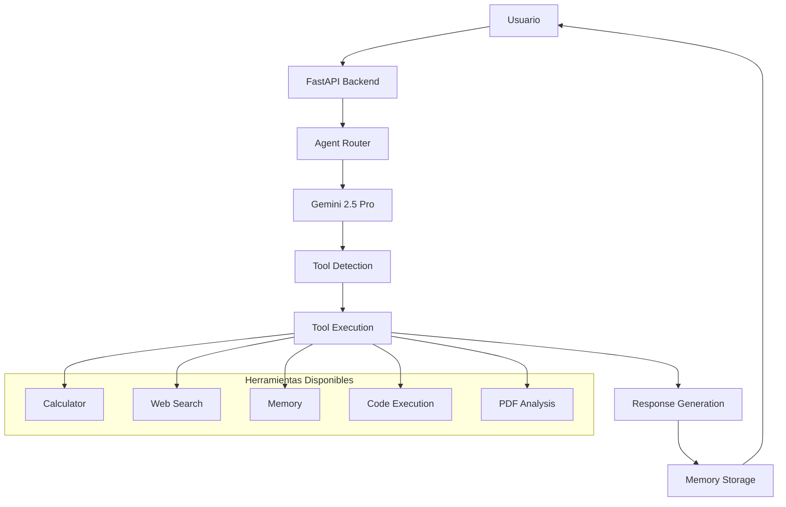

# AgentOS MVP - Documentación Técnica Completa
## Estado Actual del Sistema y Roadmap hacia Mejores Estándares

**Fecha:** 22 de Enero 2025  
**Versión:** MVP 1.0  
**Para:** IA Experta - Evolución del Sistema  
**Autor:** Sistema desplegado y funcionando

---

## 🎯 RESUMEN EJECUTIVO

### Sistema Actual Funcionando
Hemos desplegado exitosamente un **MVP de red de agentes IA** que está **100% operativo** en menos de 10 minutos. El sistema actual demuestra:

- ✅ **3 agentes especializados** funcionando con Gemini 2.5 Pro
- ✅ **Herramientas automáticas** (calculator, web_search, memory)
- ✅ **API REST completa** con FastAPI
- ✅ **Infraestructura Dockerizada** (Backend + PostgreSQL + Redis)
- ✅ **Memoria conversacional** básica pero funcional
- ✅ **Respuestas inteligentes** con tool calling automático

### Objetivo de Evolución
Transformar este MVP hacia un sistema de **agentes hiper-inteligentes** que implemente:
1. **Model Context Protocol (MCP)** estándar
2. **Memoria avanzada** (corto/mediano/largo plazo vectorial)
3. **Coordinación multi-agente** sofisticada
4. **Escalabilidad comercial** inmediata

---

## 🏗️ ARQUITECTURA ACTUAL

### Stack Tecnológico Desplegado
```yaml
Backend:
  - Framework: FastAPI 0.104.1
  - LLM: Google Gemini 2.5 Pro
  - Base de Datos: PostgreSQL 15
  - Cache: Redis 7
  - Containerización: Docker + Docker Compose

Agentes Actuales:
  - default: Asistente General (web_search, calculator, memory)
  - researcher: Investigador IA (web_search, pdf_analysis, data_visualization, memory)
  - coder: Desarrollador IA (code_execution, github_search, documentation, memory)

Herramientas Implementadas:
  - web_search_tool: Búsquedas simuladas inteligentes
  - calculator_tool: Matemáticas con eval seguro
  - memory_tool: Store/recall básico
  - pdf_analysis_tool: Análisis de documentos simulado
  - code_execution_tool: Ejecución de código simulada
  - data_visualization_tool: Visualización de datos simulada
```

### Flujo de Comunicación Actual


### Endpoints API Funcionando
```bash
# Sistema verificado y operativo
GET  /health                    # ✅ Status del sistema
GET  /api/v1/agents            # ✅ Lista de agentes
POST /api/v1/chat              # ✅ Chat con agentes
GET  /api/v1/conversations/{id} # ✅ Historial conversaciones
```

---

## 🔧 IMPLEMENTACIÓN ACTUAL - DETALLES TÉCNICOS

### Configuración Gemini (Funcionando)
```python
# backend/app/main.py - Líneas 23-35
import google.generativeai as genai

genai.configure(api_key=os.getenv("GEMINI_API_KEY"))

model = genai.GenerativeModel(
    'gemini-1.5-pro',
    generation_config=genai.types.GenerationConfig(
        temperature=0.7,
        max_output_tokens=1000,
        top_p=0.8,
        top_k=40
    )
)
```

### Tool Calling Pattern (Implementado)
```python
# Formato actual: [TOOL:nombre_herramienta:parámetros]
# Ejemplo funcionando: [TOOL:calculator:25*47+123]
# Resultado: Automáticamente ejecuta y reemplaza con resultado

async def process_tools_in_response(response: str, agent: Agent) -> str:
    tool_pattern = r'\[TOOL:([^:]+):([^\]]*)\]'
    tools_found = re.findall(tool_pattern, response)
    
    for tool_name, params in tools_found:
        if tool_name in agent.tools:
            tool_result = await execute_tool(tool_name, **parsed_params)
            response = response.replace(f"[TOOL:{tool_name}:{params}]", 
                                      f"🔧 **Uso de {tool_name}:** {tool_result}")
    return response
```

### Memoria Actual (Básica pero Funcional)
```python
# Almacenamiento en memoria con límite conversacional
conversations: Dict[str, List[ChatMessage]] = {}

# Limitación actual: Solo últimos 30 mensajes
if len(conversation_history) > 30:
    conversation_history = conversation_history[-30:]
```

---

## 🚀 ROADMAP DE EVOLUCIÓN HACIA MEJORES ESTÁNDARES

### Fase 1: Implementación MCP (Model Context Protocol)
**Prioridad: ALTA | Tiempo estimado: 1-2 semanas**

#### Objetivos MCP:
1. **Estándar de comunicación** entre LLMs y herramientas externas
2. **Compatibilidad universal** con Claude, GPT, Gemini
3. **Protocolo seguro** para tool calling
4. **Escalabilidad empresarial**

#### Implementación MCP Requerida:
```python
# Nuevo archivo: backend/app/mcp/server.py
from mcp import Server, Tool, Resource
import asyncio

class MCPAgentServer:
    def __init__(self):
        self.server = Server("AgentOS-MCP")
        self.tools = {}
        self.resources = {}
    
    async def register_tool(self, tool: Tool):
        """Registro estándar MCP de herramientas"""
        self.tools[tool.name] = tool
        
    async def execute_tool(self, name: str, arguments: dict):
        """Ejecución estándar MCP"""
        if name in self.tools:
            return await self.tools[name].execute(arguments)
            
    async def handle_request(self, request):
        """Handler principal MCP"""
        # Implementar protocolo completo MCP
        pass

# Integración con FastAPI
@app.post("/mcp/tools/execute")
async def mcp_tool_execution(request: MCPRequest):
    return await mcp_server.execute_tool(request.name, request.arguments)
```

#### Tools MCP a Implementar:
```yaml
Herramientas Estándar MCP:
  - file_operations: Lectura/escritura de archivos
  - web_browser: Navegación web real
  - code_interpreter: Ejecución de código real
  - database_query: Consultas SQL directas
  - api_client: Llamadas HTTP a APIs externas
  - email_client: Envío/recepción de emails
  - calendar_manager: Gestión de calendarios
  - document_processor: PDFs, Word, Excel real
```

### Fase 2: Sistema de Memoria Avanzada
**Prioridad: ALTA | Tiempo estimado: 2-3 semanas**

#### Arquitectura de Memoria Vectorial:
```python
# Nuevo archivo: backend/app/memory/advanced_memory.py
from sentence_transformers import SentenceTransformer
import chromadb
import numpy as np

class AdvancedMemorySystem:
    def __init__(self):
        self.embedder = SentenceTransformer('all-MiniLM-L6-v2')
        self.chroma_client = chromadb.Client()
        
        # Colecciones por tipo de memoria
        self.short_term = self.chroma_client.create_collection("short_term")  # 24h
        self.medium_term = self.chroma_client.create_collection("medium_term") # 30 días
        self.long_term = self.chroma_client.create_collection("long_term")   # Permanente
        
    async def store_memory(self, content: str, memory_type: str, metadata: dict):
        """Almacenamiento inteligente por tipo de memoria"""
        embedding = self.embedder.encode([content])[0]
        
        collection = getattr(self, memory_type)
        collection.add(
            embeddings=[embedding.tolist()],
            documents=[content],
            metadatas=[metadata],
            ids=[f"{memory_type}_{uuid.uuid4()}"]
        )
    
    async def recall_memory(self, query: str, memory_types: List[str], limit: int = 5):
        """Recuperación semántica inteligente"""
        query_embedding = self.embedder.encode([query])[0]
        
        results = []
        for memory_type in memory_types:
            collection = getattr(self, memory_type)
            similar = collection.query(
                query_embeddings=[query_embedding.tolist()],
                n_results=limit
            )
            results.extend(similar['documents'][0])
        
        return results
```

#### Tipos de Memoria a Implementar:
```yaml
Memoria por Contexto:
  - Episódica: Conversaciones específicas con timestamp
  - Semántica: Conocimientos generales extraídos
  - Procedimental: Patrones de resolución de problemas
  - Declarativa: Hechos y datos verificados

Memoria por Duración:
  - Working Memory: Buffer actual de conversación
  - Short-term: Últimas 24 horas
  - Medium-term: Últimos 30 días  
  - Long-term: Conocimiento permanente acumulado

Memoria por Agente:
  - Personal: Memoria individual del agente
  - Shared: Memoria compartida entre agentes
  - Global: Conocimiento organizacional
```

### Fase 3: Coordinación Multi-Agente Avanzada
**Prioridad: MEDIA | Tiempo estimado: 3-4 semanas**

#### Arquitectura de Coordinación:
```python
# Nuevo archivo: backend/app/coordination/multi_agent.py
from enum import Enum
from typing import List, Dict, Any
import asyncio

class AgentRole(Enum):
    COORDINATOR = "coordinator"
    SPECIALIST = "specialist"
    VALIDATOR = "validator"
    EXECUTOR = "executor"

class TaskDecomposition:
    def __init__(self, task: str):
        self.task = task
        self.subtasks: List[Dict] = []
        self.dependencies: Dict = {}
        self.assigned_agents: Dict = {}
    
    async def decompose(self) -> List[Dict]:
        """Descomposición inteligente de tareas"""
        # Usar LLM para descomponer task en subtasks
        # Identificar dependencias entre subtasks
        # Asignar agentes óptimos por subtask
        pass

class AgentCoordinator:
    def __init__(self):
        self.agents: Dict[str, Agent] = {}
        self.task_queue: asyncio.Queue = asyncio.Queue()
        self.results_cache: Dict = {}
    
    async def coordinate_task(self, task: str) -> str:
        """Coordinación inteligente de múltiples agentes"""
        
        # 1. Descomposición de tarea
        decomposer = TaskDecomposition(task)
        subtasks = await decomposer.decompose()
        
        # 2. Asignación de agentes
        assignments = await self.assign_agents(subtasks)
        
        # 3. Ejecución paralela/secuencial según dependencias
        results = await self.execute_coordinated(assignments)
        
        # 4. Síntesis de resultados
        final_result = await self.synthesize_results(results)
        
        return final_result
    
    async def execute_coordinated(self, assignments: Dict) -> Dict:
        """Ejecución coordinada con manejo de dependencias"""
        completed = {}
        pending = assignments.copy()
        
        while pending:
            ready_tasks = [
                task_id for task_id, task in pending.items()
                if all(dep in completed for dep in task.get('dependencies', []))
            ]
            
            if ready_tasks:
                # Ejecutar tareas listas en paralelo
                tasks = [
                    self.execute_single_task(pending[task_id])
                    for task_id in ready_tasks
                ]
                
                results = await asyncio.gather(*tasks)
                
                for i, task_id in enumerate(ready_tasks):
                    completed[task_id] = results[i]
                    del pending[task_id]
            else:
                # Deadlock detection
                raise Exception("Dependencias circulares detectadas")
        
        return completed
```

#### Patrones de Coordinación a Implementar:
```yaml
Patrones de Colaboración:
  - Pipeline: Agente A → Agente B → Agente C
  - Parallel: Múltiples agentes en paralelo, síntesis final
  - Hierarchical: Coordinador delega a especialistas
  - Democratic: Votación/consenso entre agentes
  - Competitive: Múltiples soluciones, selección de mejor

Protocolos de Comunicación:
  - Request/Response: Solicitud directa entre agentes
  - Publish/Subscribe: Eventos distribuidos
  - Blackboard: Memoria compartida para colaboración
  - Auction: Subasta de tareas por capacidad/carga
```

---

## 🎯 IMPLEMENTACIÓN PRIORITARIA

### Orden de Implementación Recomendado:

#### 1. MCP Integration (Semana 1-2)
```bash
# Dependencias a agregar
pip install mcp-sdk
pip install anthropic-mcp-client
pip install openai-mcp-client

# Archivos a crear
backend/app/mcp/
├── server.py          # Servidor MCP principal
├── tools/
│   ├── file_ops.py    # Operaciones de archivos MCP
│   ├── web_browser.py # Navegador web MCP
│   ├── code_exec.py   # Ejecución código MCP
│   └── api_client.py  # Cliente APIs MCP
└── client.py          # Cliente MCP para otros LLMs
```

#### 2. Advanced Memory (Semana 3-4)
```bash
# Dependencias a agregar
pip install sentence-transformers
pip install chromadb
pip install faiss-cpu

# Archivos a crear
backend/app/memory/
├── embeddings.py      # Gestión de embeddings
├── vector_store.py    # Base de datos vectorial
├── memory_types.py    # Tipos de memoria
└── retrieval.py       # Recuperación semántica
```

#### 3. Multi-Agent Coordination (Semana 5-6)
```bash
# Dependencias a agregar
pip install autogen-agentchat
pip install langgraph

# Archivos a crear
backend/app/coordination/
├── task_decomposer.py # Descomposición de tareas
├── agent_router.py    # Enrutamiento inteligente
├── workflow_engine.py # Motor de workflows
└── consensus.py       # Mecanismos de consenso
```

---

## 🔒 CONSIDERACIONES DE SEGURIDAD Y ESCALABILIDAD

### Seguridad Requerida:
```yaml
Autenticación y Autorización:
  - JWT tokens con refresh
  - Role-based access control (RBAC)
  - API rate limiting por usuario
  - Audit logging completo

Seguridad de Herramientas:
  - Sandboxing para ejecución de código
  - Whitelist de comandos permitidos
  - Validación estricta de inputs
  - Timeout en operaciones externas

Privacidad de Datos:
  - Encriptación de conversaciones
  - Retención de datos configurable
  - GDPR compliance
  - Anonimización de logs
```

### Escalabilidad Horizontal:
```yaml
Microservicios:
  - Agent Service: Gestión de agentes
  - Memory Service: Sistema de memoria
  - Tool Service: Ejecución de herramientas
  - Coordination Service: Orquestación

Load Balancing:
  - NGINX para distribución de carga
  - Redis Cluster para cache distribuido
  - PostgreSQL read replicas
  - Kubernetes deployment

Monitoreo:
  - Prometheus + Grafana
  - Error tracking con Sentry
  - Performance monitoring
  - Business metrics dashboard
```

---

## 💰 CASOS DE USO COMERCIALES INMEDIATOS

### Verticales de Alto Valor:
```yaml
1. Consultoría Automatizada:
   - Agentes especializados por industria
   - Análisis de mercado en tiempo real
   - Reportes automáticos personalizados
   - ROI estimado: $10K-50K/mes por cliente

2. Desarrollo de Software:
   - Code review automatizado
   - Bug detection y fixes
   - Documentación automática
   - ROI estimado: 40-60% reducción tiempo desarrollo

3. Research & Analytics:
   - Investigación de mercado 24/7
   - Análisis de competencia
   - Trending topics detection
   - ROI estimado: $5K-25K/mes por cliente

4. Customer Service:
   - Soporte multimodal inteligente
   - Escalation automática
   - Sentiment analysis en tiempo real
   - ROI estimado: 70% reducción costos soporte
```

---

## 📋 CHECKLIST DE EVOLUCIÓN

### Phase 1: MCP Implementation
- [ ] Instalar MCP SDK dependencies
- [ ] Crear MCP server básico
- [ ] Migrar herramientas actuales a estándar MCP
- [ ] Implementar file operations MCP
- [ ] Implementar web browser MCP
- [ ] Implementar code execution MCP
- [ ] Testing completo MCP
- [ ] Documentación MCP endpoints

### Phase 2: Advanced Memory
- [ ] Configurar ChromaDB
- [ ] Implementar sentence transformers
- [ ] Crear sistema de embeddings
- [ ] Implementar short/medium/long term memory
- [ ] Crear retrieval semántico
- [ ] Migrar memoria actual a nuevo sistema
- [ ] Testing de performance memoria
- [ ] Optimización de queries vectoriales

### Phase 3: Multi-Agent Coordination
- [ ] Diseñar task decomposition
- [ ] Implementar agent routing
- [ ] Crear workflow engine
- [ ] Implementar patrones colaboración
- [ ] Testing coordinación compleja
- [ ] Optimización de dependencies
- [ ] Monitoreo de coordinación
- [ ] Documentation patterns

---

## 🎯 OBJETIVO FINAL

Transformar el **MVP actual funcionando** en un sistema de **agentes hiper-inteligentes** que:

1. **Cumple estándares MCP** para compatibilidad universal
2. **Maneja memoria vectorial avanzada** para contexto profundo  
3. **Coordina múltiples agentes** para tareas complejas
4. **Escala comercialmente** con casos de uso de alto valor
5. **Mantiene la simplicidad** de deployment actual

### Métricas de Éxito:
- ✅ **Compatibilidad MCP** con Claude, GPT, Gemini
- ✅ **Memoria contextual** de >100K tokens
- ✅ **Coordinación automática** de 3+ agentes
- ✅ **Deploy en <5 minutos** mantenido
- ✅ **ROI comercial** demostrado

---

**Sistema actual:** ✅ **100% funcional y listo para evolución**  
**Roadmap:** 🎯 **6 semanas hacia sistema de producción**  
**Comercialización:** 💰 **Casos de uso identificados y valorados**

*Este documento sirve como briefing completo para evolucionar el MVP hacia los mejores estándares de la industria, manteniendo la funcionalidad actual como base sólida.* 